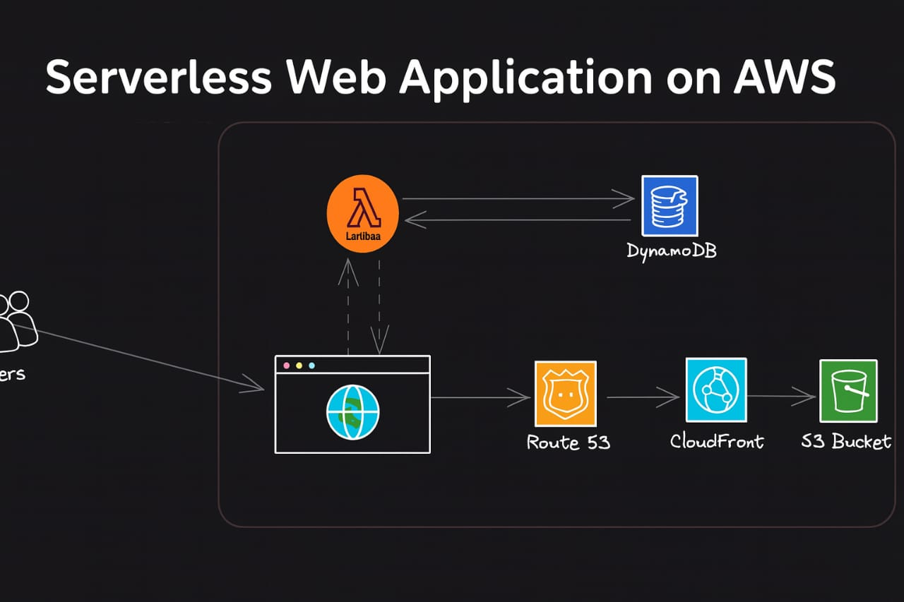
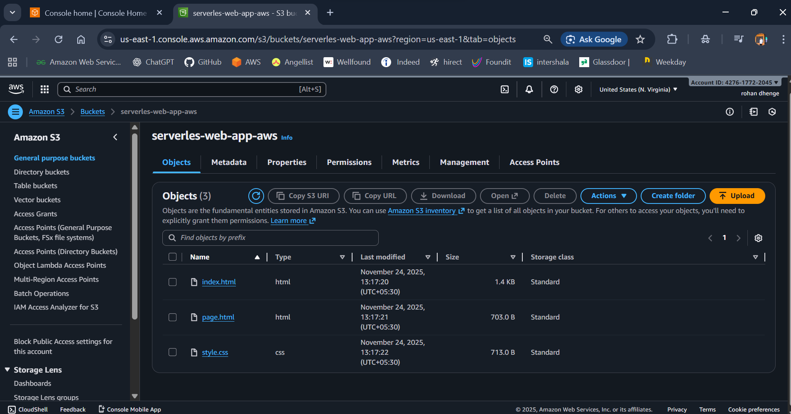
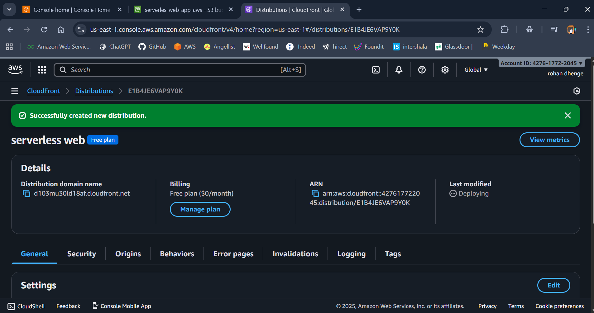
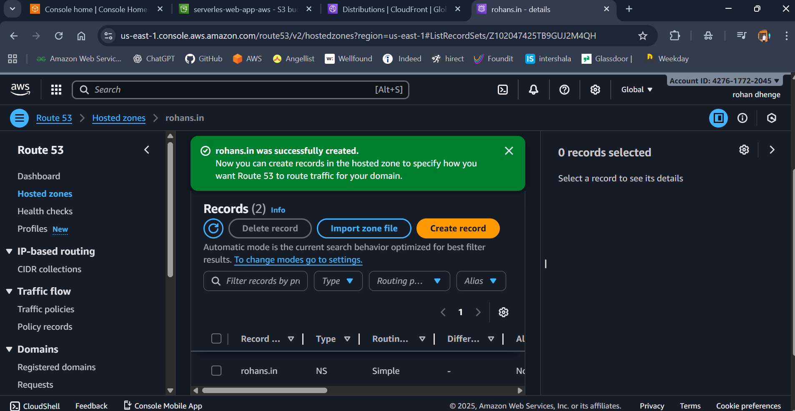
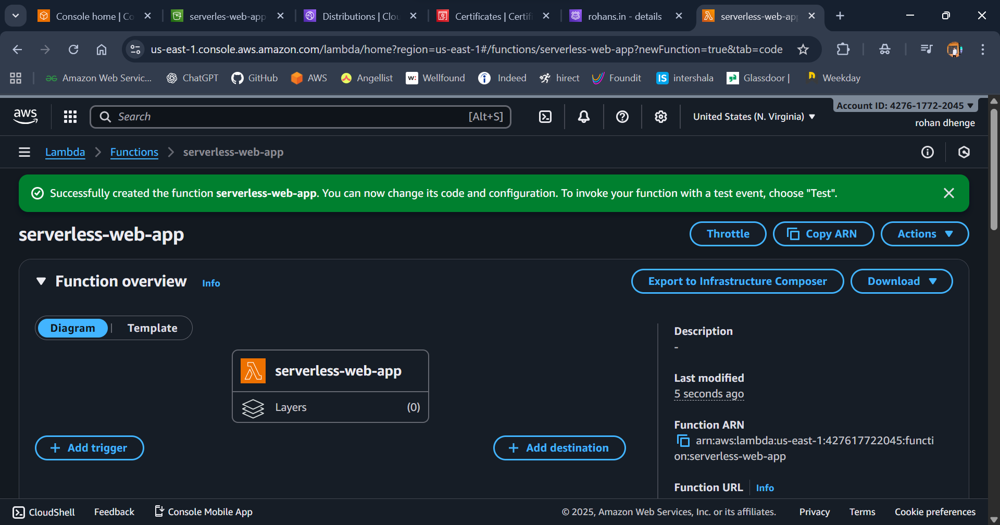
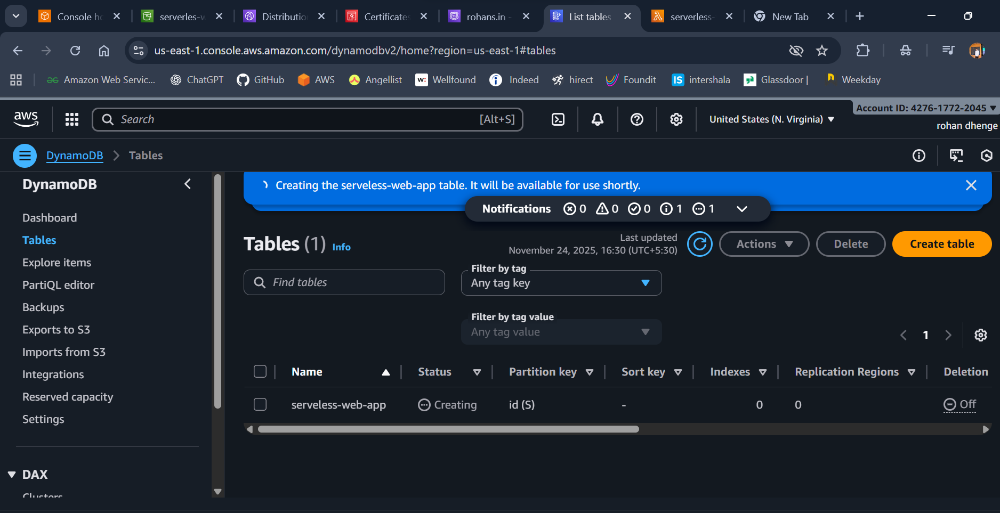
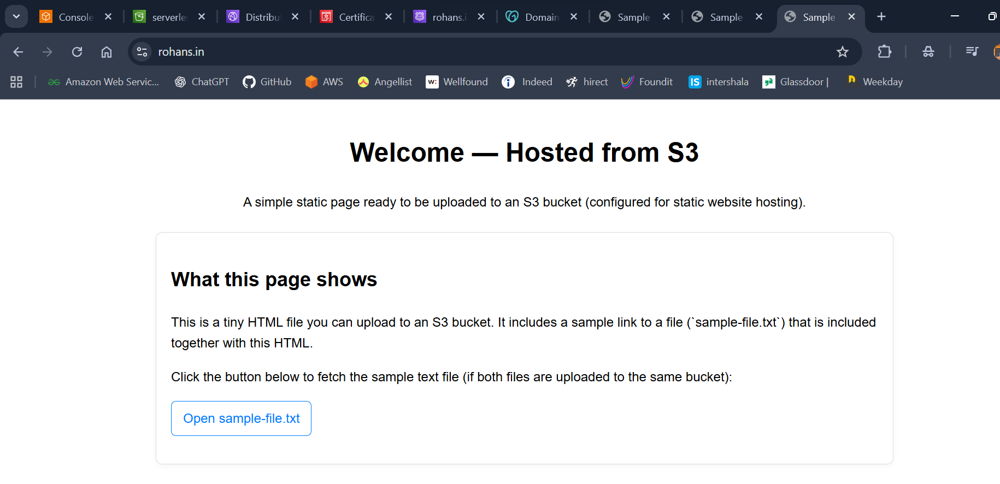

# Serverless Web Application on AWS

This project contains the architecture diagram and explanation of a Serverless Web Application built using AWS services.

## Architecture Overview

The application uses the following AWS services:

- **Amazon S3** – Hosts static web content.

- **Amazon CloudFront** – Content Delivery Network for global low‑latency access.

- **Amazon Route 53** – DNS routing for custom domain.

- **AWS Lambda** – Serverless backend logic.

- **Amazon DynamoDB** – NoSQL database.

## How It Works

1. User accesses the website through the domain managed by Route 53.
2. Route 53 routes the request to CloudFront.
3. CloudFront fetches static content from the S3 bucket.
4. Web application interacts with Lambda for API calls.
5. Lambda performs operations using DynamoDB and returns responses.

# First Page

# Lambda Final Overview 

## Services used
 Service        | Purpose                    |
| -------------- | -------------------------- |
| **S3**         | Hosts static website files |
| **CloudFront** | CDN distribution           |
| **Route 53**   | Domain & DNS               |
| **Lambda**     | Backend compute            |
| **DynamoDB**   | Application data store     |

  ## Use Cases

Portfolio websites

E-commerce product catalog

Event registration system

Survey or feedback forms

Any lightweight web application with dynamic backend

